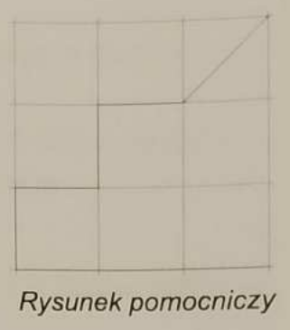
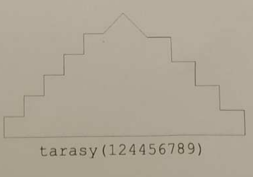
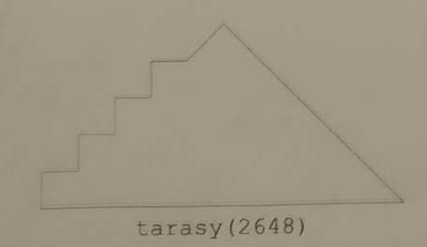
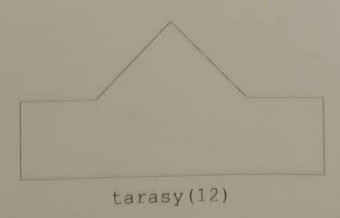

## Zadania 2. etapu konkursu LOGIA  
_przedmiotowego konkursu informatycznego dla uczniów klas IV-VIII szkół podstawowych województwa mazowieckiego_  
**22 stycznia 2025 roku**

---

### Zadanie 1. Tarasy  

Karol uprawia na zboczach góry dwa rodzaje roślin:  
- Gatunki wymagające więcej światła opisuje za pomocą cyfr `2, 4, 6, 8`,  
- Gatunki rosnące w cieniu oznacza cyframi `1, 3, 5, 7, 9`.  

Zapisał rośliny zaplanowane do posadzenia w najbliższym roku jako cyfry pewnej liczby. Następnie przygotowuje trójkątny przekrój góry z tarasami:  
- **Cyfry parzyste** znajdują się po lewej stronie,  
- **Cyfry nieparzyste** po prawej stronie.  

Każda cyfra oznacza roślinę uprawianą na osobnym tarasie. Nad ostatnim tarasem pozostawia fragment zbocza o wysokości równej szerokości tarasu.  

#### Zadanie
Napisz **jednoparametrową funkcję `tarasy()`**, która po wywołaniu rysuje przekrój góry z tarasami.  
- **Parametr funkcji**: liczba całkowita dodatnia, maksymalnie 10-cyfrowa, bez cyfr `0`.  
- **Wymiary rysunku**: wysokość = 300, szerokość = 600.  
- Każdy taras ma taką samą wysokość i szerokość (zależną od liczby tarasów).  
- Rysunek powinien być wyśrodkowany na ekranie.  

#### Przykłady:

|      |                          |
| ------------------------ | ------------------------ |
|      |   |
|   |   |

---

### Zadanie 2. Oświetlenie  

Tomek opracowuje projekt oświetlenia inteligentnego domu. Lampa zapala się, gdy natężenie światła jest poniżej dolnej wartości granicznej, a gaśnie, gdy jest powyżej górnej wartości granicznej.  

#### Zadanie
Napisz program, który:  
1. Wczytuje wartości graniczne oraz kolejne wartości natężenia światła.  
2. Liczy, ile razy lampa **zapalała się** i ile razy **gasła**.  
3. Na początku lampa jest **zgaszona**.

#### Wejście:
1. Pierwszy wiersz zawiera dwie liczby całkowite `a` i `b` (oddzielone spacją):  
   - `a`: dolna wartość graniczna,  
   - `b`: górna wartość graniczna.  
   _Warunek_: `0 ≤ a < b < 255`.  
2. Drugi wiersz zawiera ciąg liczb całkowitych (maksymalnie 1000), oddzielonych spacją, z zakresu `0-255`.

#### Wyjście:
Jedna linia zawierająca dwie liczby całkowite oddzielone spacją:  
- Ile razy lampa **zapalała się**,  
- Ile razy lampa **gasła**.

#### Przykłady:
| Wejście                        | Wyjście |
| ------------------------------ | ------- |
| 20 100                         | 2 1     |
| 50 15 25 10 50 120 80 90 110 5 |         |
| 50 150                         | 3 2     |
| 61 40 70 160 33 82 200 0       |         |
| 99 101                         | 2 2     |
| 0 250 0 250                    |         |

---

### Zadanie 3. Królik  

Królik przygotowuje się do wysiewu marchwi. Chce, aby wszystkie marchewki wykiełkowały i nie chce zbyt długo czekać na pierwsze plony:  
- Posiane zbyt płytko nie wzejdą,  
- Zbyt głębokie wydłużają czas oczekiwania.  

Aby to osiągnąć:  
- Jeśli choć jeden dołek jest za płytki, królik pogłębia wszystkie za płytkie dołki.  
- Jeśli wszystkie dołki są wystarczająco głębokie, królik dosypuje ziemię w najpłytszych dołkach.

#### Zadanie
Napisz program, który:  
1. Wczytuje minimalną głębokość do posadzenia marchewki.  
2. Wczytuje głębokości dołków.  
3. Oblicza łączną zmianę głębokości dołków (sumę pogłębień lub dosypanej ziemi).

#### Wejście:
1. Pierwszy wiersz zawiera liczbę całkowitą `g` – minimalna głębokość (1 ≤ g ≤ 1000).  
2. Drugi wiersz zawiera ciąg liczb całkowitych (maks. 100 000) z zakresu `1-2000`, określających głębokości kolejnych dołków.

#### Wyjście:
Jedna liczba całkowita – suma zmian głębokości.

#### Przykłady:
| Wejście              | Wyjście | Wyjaśnienie                        |
| -------------------- | ------- | ---------------------------------- |
| 20                   | 17      | Pogłębiono 1. dołek o 12 i 3. o 5. |
| 8 30 15 40 20        |         |                                    |
| 12                   | 36      | Dosypano w 1. i 5. dołku po 18.    |
| 35 40 50 40 30 60 70 |         |                                    |
| 10                   | 2       | Należy pogłębić 1 dołek o 2.       |
| 8 30 15 40 20        |         |                                    |

---

### Zadanie 4. Palindrom  

Ania i Jola lubią zabawy z napisami. Jola podaje Ani zestaw liter, a Ania próbuje zbudować najdłuższy możliwy **palindrom** (napis czytany tak samo w obu kierunkach, np. "oko", "kajak", "abba").  

#### Zadanie
Napisz program, który:  
1. Wczytuje zestaw liter Joli (małe litery alfabetu łacińskiego).  
2. Znajduje pierwszy w kolejności alfabetycznej, najdłuższy możliwy palindrom.  

#### Wejście:
Niepusty napis złożony z małych liter (maks. 1000 znaków).

#### Wyjście:
Najdłuższy możliwy palindrom.

#### Przykłady:
| Wejście               | Wyjście          |
|-----------------------|------------------|
| abba                  | abba             |
| abrakadabrahokuspokus | aabkorsuausrokbaa|
| kajak                 | akjka            |

